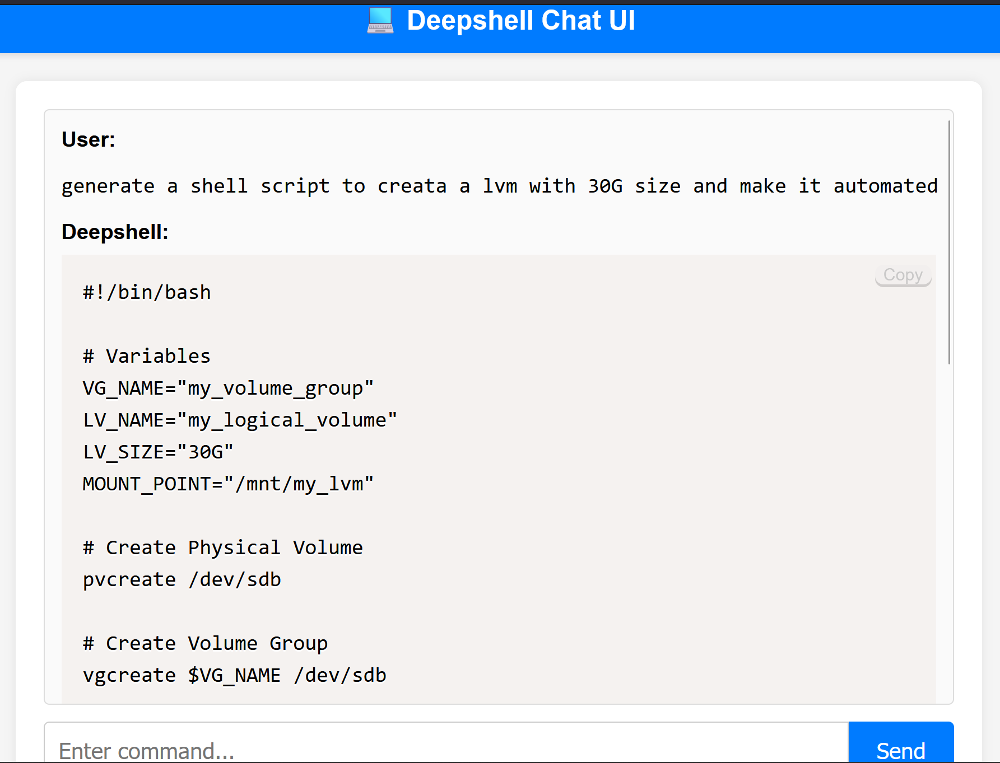

---

# 💻 Deepshell UI


[](https://github.com/muralipala1504/deepshell-ui/releases)

_A lightweight web UI for the **Deepshell** AI Shell Assistant._

---

## 🚀 What is Deepshell UI?

Deepshell‑UI is a **domain‑focused Infra & DevOps AI assistant**, built for  
**Linux Sysadmins, DevOps Engineers, Cloud Engineers, and IaC Specialists**.  

Unlike generic chatbots or wrappers, **it rejects out‑of‑domain queries** (trivia, poems, recipes, etc.) and focuses only on delivering **copy‑ready Linux, Cloud, and IaC commands/scripts**.

---

## ✨ Features

- Intuitive **chat‑style interface**
- Syntax‑highlighted outputs with **Copy‑to‑Clipboard**
- Rejects irrelevant/non‑infra prompts → **no nonsense answers**
- Clean & responsive layout with scrollable responses
- Seamless integration with the **Deepshell backend API**

---

## 🛠️ Tech Stack

- **Frontend**: HTML, CSS, Vanilla JS, Prism.js  
- **Backend**: FastAPI, Uvicorn, Typer, OpenAI (LiteLLM), psutil, Rich  
- **Other**: YAML for config, Python 3.9+

---

## 🖼️ Preview

  
*Example: Infra‑only assistant → rejects capital‑cities, delivers `df -h` instantly*

---

## ⚡ Getting Started

### Prerequisites
- Python **3.9+**
- Git
- OpenAI API Key (required for backend AI calls)

### Installation

```bash
git clone https://github.com/muralipala1504/deepshell-ui.git
cd deepshell-ui
```

```bash

pip install -r deepshell-backend/requirements.txt
pip install -e deepshell-backend/

```

Set your OpenAI API key:

Linux/macOS

```bash
export OPENAI_API_KEY="your_openai_api_key_here"
```

Windows PowerShell

```pshell

$env:OPENAI_API_KEY="your_openai_api_key_here"

```

⚡ Firewall Config (Linux only):

```bash
sudo firewall-cmd --add-port=8001/tcp --permanent
sudo firewall-cmd --reload

```

Run the backend:

```bash

python run_deepshell.py > deepshell.log 2>&1 &

```

Now open in browser:

```bash

http://localhost:8001

```

👉 If remote, replace localhost with your server IP.

🛑 To stop server: hit Ctrl + C in terminal.


🤝 Contributing

Open issues, submit PRs — contributions welcome!
Help shape the future of Deepshell 🚀


🤖 AI Assistance

This project was developed with help from AI models (OpenAI GPT, Gemini 2.5 Flash) for code, debugging, and docs.
🛠️ All code has been reviewed, hardened, and validated by the maintainer.


📜 License

MIT Licensed. See LICENSE for details.

🛣️ Roadmap

    🌙 Dark mode theme
    💾 Persistent chat history
    📂 Save/export responses to file
    ⚡ Multi‑LLM backend (OpenAI, Anthropic, Local LLMs)
    🔄 Clear/reset chat sessions
    🛠️ More infra helpers (Cloud CLI, Ansible, Terraform, etc.)

⭐ Star this repo if you find it useful!

---
